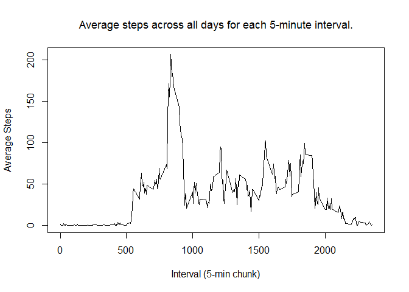

# Reproducible Research: Peer Assessment 1
bkcq  
Sunday, April 12, 2015  
The following assumes that the *activity.csv* file containing all the
relevant data is in the working directory.  

## Loading and preprocessing the data  

The first step is to load the *activity.csv* file into a *data.frame*.  We will
be using *dplyr* for various functions, so lets load that now as well.  We will also
wrap the *data.frame* in a table interface, and get a version without missing data.

```r
    require(dplyr, quietly=TRUE, warn.conflicts=FALSE)
```

```
## Warning: package 'dplyr' was built under R version 3.1.3
```

```r
    dft<-tbl_df(read.csv("activity.csv"))
    dft_noNA<-filter(dft,!is.na(steps))
```


## What is mean total number of steps taken per day?

Here we summarise the data to determine the *mean* of the totals steps per day.
This involves getting the SUM of steps per day, then calculating the mean.

```r
    steps_by_date<-dft_noNA %>% group_by(date) %>% summarise(sum=sum(steps))
    mean_steps_noNA<-format(mean(steps_by_date$sum), nsmall=2, digits=2)
    median_steps_noNA<-median(steps_by_date$sum)
```
The mean of the total steps per day in the dataset is 10766.19.  

The median of the total steps per day in the dataset is 10765.
  
The final part of this section is to simply plot a histogram of the total steps
per day.

```r
    hist(steps_by_date$sum, breaks=nrow(steps_by_date), xlab="Total Step Count", main="Histogram of Total Step Count per Date", xaxp=c(0,25000,5), col="light yellow")
```

 


## What is the average daily activity pattern?

For this section we are to:
  
  
1. make a time series plot of the Interval (x-axis) vs the average steps across all 
days for that interval.  

2. determine the interval with the highest average step count (across all days)

So first we need to group the data accordingly, and again will simply ignore missing values:

```r
    avg_steps_by_int<-dft_noNA %>% group_by(interval) %>% summarise(mean=mean(steps))
    max_steps_int_by_int<-filter(avg_steps_by_int,avg_steps_by_int$mean==max(avg_steps_by_int$mean))$interval
    max_steps_by_int<-format(max(avg_steps_by_int$mean),nsmall=2,digits=2)
    plot(avg_steps_by_int,type="l", xlab="Interval (5-min chunk)", ylab="Average Steps", main="Average steps across all days for each 5-minute interval.", font.main=1, cex.main=1.1)
```

 
  

The 5-minute time interval with the highest average number of steps (206.17) taken is interval number 835.


## Imputing missing values


This section requires us to create and implement a strategy to deal with missing data.
Missing data may create a bias in the calculated values, leading to erroneous decisions in later analyses.
  
Specifically, we are asked to:  

1. Determine the total number of missing values.
1. Devise a strategy for replacing missing values.
1. Create a new dataset with the missing values replaced.
1. Plot a histogram of total steps per day, and determine the mean and median.  Are these different from the first estimates?  How did our strategy affect the calculations?
  

```r
#we already have two data.frames one with NA's and one without
numNAs<-nrow(dft)-nrow(dft_noNA)
```
  
The number of missing values is 2304.

So, let's take a look at the data if we replace all NA's with something stupid like 5000, since the max steps in an interval happens to be 806 (via max(dft_noNA$steps) done in the console).
  
This exploratory plot won't have any fancy labels, colors, etc.  It is just for exploring our data.


```r
    y<-dft 
    x<-complete.cases(y$steps)
    y$steps<-replace(y$steps,!x,5000)
    plot(y$steps,pch=19,cex=0.01)
```

 
  
This plot seems to show that there are contiguous blocks of NA, so looking at data ahead or behind the missing data block may be difficult, and provide little benefit over simpler approaches.  Given that there are large stretches of missing data across intervals, lets replace NA's with the average step count for that interval (since that was calculated earlier).


```r
y<-dft
for(i in 1:nrow(y)){if (is.na(y[i,1])){y[i,1]<-as.integer(avg_steps_by_int[avg_steps_by_int$interval==y$interval[i],2])}}
```
  
  So let's take a look and see if we've introduced any obvious biases.
  

```r
    plot(y$steps,pch=19,cex=0.01)
```

 

  Looks good, so let go ahead and use this data set, and clean up our exploration data.
  

```r
dft<-y
rm(x,y)
```

  
  Now we have replaced the missing data with a reasonable estimate we can answer the remaining questions.  
  

```r
    steps_by_date_full<-dft %>% group_by(date) %>% summarise(sum=sum(steps))
    mean_steps_full<-format(mean(steps_by_date_full$sum), nsmall=2, digits=2)
    median_steps_full<-median(steps_by_date_full$sum)
```
The mean of the total steps per day in the full dataset is 10749.77.  

The median of the total steps per day in the full dataset is 10641.
  
The final part of this section is to simply plot a histogram of the total steps
per day.

```r
    hist(steps_by_date_full$sum, breaks=nrow(steps_by_date_full), xlab="Total Step Count", main="Histogram of Total Step Count per Date", xaxp=c(0,25000,5), col="light yellow")
```

 
  
  
The final questions to be answered were if our replacement strategy affected the calculations.

The mean calculated without replacing missing data was 10766.19, and the new mean is 10749.77.  This is 0.1526 percent different.
  
The median calculated without replacing missing data was 10765, and the new median is 10641.  This is 1.1586 percent different.

  
Also, the distribution is different, below is a comparative plot using lattice

```r
    require(lattice)
```

```
## Loading required package: lattice
```

```r
    steps_by_date$missing<-"Ignored"
    steps_by_date_full$missing<-"Replaced"
    plotDF<-rbind(steps_by_date,steps_by_date_full)
    histogram(~sum|missing, data=plotDF, breaks=nrow(steps_by_date_full), main="Effect of Replacing Missing Data", xlab="Step Count")
```

 
  
  
We can observe that while the mean and median values were only minimally effected, the distribution of total steps per day was changed enough to be visually discernable. 
  
Just for fun, what if we used a simple replacement strategy?
  
What if we just replace the NA's with the average of the data (10765) divided by the number of intervals (288) per day (hint, the replacement value is 37)?
  

```r
y<-read.csv("activity.csv")
for(i in 1:nrow(y)){if (is.na(y[i,1])){y[i,1]<-37}}
```
  

```r
    steps_by_date_simple<-y %>% group_by(date) %>% summarise(sum=sum(steps))
    mean_steps_simple<-format(mean(steps_by_date_simple$sum), nsmall=2, digits=2)
    median_steps_simple<-median(steps_by_date_simple$sum)
```
  
  The simple mean is 10751.74 while the slightly more complicated full dataset mean is 10749.77.
  
  The simple median is 1.0656\times 10^{4} while the slightly more complicated full dataset mean is 10641.
  
  
## Are there differences in activity patterns between weekdays and weekends?
  
This section asks us to determine if there is an impact on activity based on whether the date falls on a weekday or weekend.
  
The smoother added to the plots shows that overall, activity is higher on weekends than on weekdays, even though there is a larger activity spike during the weekday.


```r
#define weekend
wkend<-c("Saturday","Sunday")
dft<-mutate(dft,daytype=ifelse(weekdays(as.Date(dft$date))%in%wkend,"Weekend","Weekday"))
dft$daytype<-factor(dft$daytype)
avg_steps_by_int_daytype<-dft %>% group_by(interval,daytype) %>% summarise(mean=mean(steps))
xyplot(mean~interval|daytype, data=avg_steps_by_int_daytype, xlab="Interval", ylab="Average Number of Steps", main="Average Number of Steps by Day Type per Interval", pch=19, cex=0.5, type=c("l", "smooth"))
```

 
  
